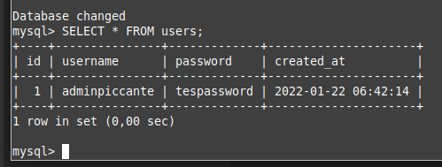

# piccante-full
Piccante adalah Website Menu Restauran Italia

Tech : Frontend (React JS), Backend (Node + Express), Database (MySQL + Sequelize)

## Clone / Download repo terlebih dahulu sebelum menggunakan
Setelah itu ketik "npm install" di masing masing folder (frontend/backend) melalui terminal

## Configurasi Database (Backend/Config/Database.js)
const db = new Sequelize('piccante', 'username', 'password', {
    host: 'localhost',
    dialect: 'mysql'
})

username diisi dengan username sql yang ada
password diisi dengan password dari username 

## Minimal Isi dari database "piccante" adalah table "users" ##
### Database Name : piccante
### Table Name : users
### Isi :

